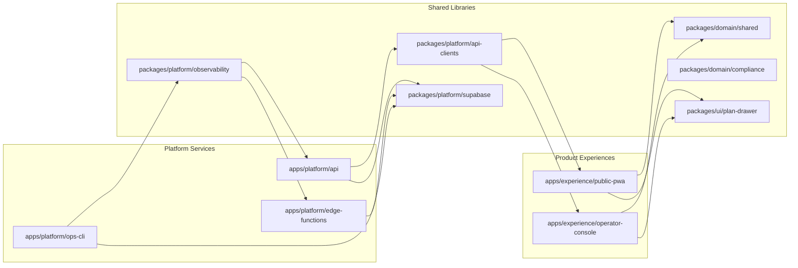
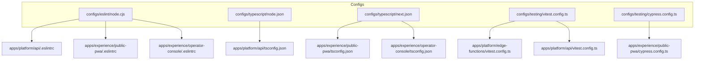

# System Overview

This overview captures how the Avocat-AI monorepo will be structured after the consolidation outlined in ADR 0002 and documents who owns each shared configuration surface.【F:docs/ADR/0002-monorepo-decision.md†L13-L58】 It emphasises the boundary between platform services, product experiences, and the new repository-wide `configs/` hierarchy.

## Workspace Domains

Platform Engineering owns the services inside `apps/platform/*`, Experience Engineering owns everything in `apps/experience/*`, and the Design Systems guild curates `packages/ui/*`. Domain logic is co-owned by Platform and Product leads to keep legal rules reusable across runtimes.【F:docs/ADR/0002-monorepo-decision.md†L26-L44】

## Shared Config Ownership

The repository consolidates linting, type checking, and testing presets into `configs/` so every workspace inherits the same rules without fragile relative paths. Previously, services imported ESLint factories through deep relative requires (for example `apps/api/.eslintrc.cjs` reaches into `packages/config/eslint/node.cjs`).【F:apps/api/.eslintrc.cjs†L1-L3】 Moving the presets to `configs/` removes the need for chained `../../` lookups and clarifies who owns each layer.

### ESLint

- **Location:** `configs/eslint/`
- **Owners:** Platform Engineering lints Node/edge runtimes; Experience Engineering lints Next.js surfaces.
- **Scope:** Provide base configs for Node services and Next.js apps. Services extend the presets directly instead of relative imports.【F:docs/ADR/0002-monorepo-decision.md†L36-L44】

### TypeScript

- **Location:** `configs/typescript/`
- **Owners:** Platform Engineering maintains `node.json` (built from the current `tsconfig.node.json`), while Experience Engineering curates `next.json` for React apps.【F:tsconfig.node.json†L1-L7】【F:apps/api/tsconfig.json†L1-L8】
- **Scope:** Publish strict compiler options that reference `tsconfig.base.json` and fan out to runtime-specific extends.【F:tsconfig.base.json†L1-L10】

### Vitest

- **Location:** `configs/testing/vitest.config.ts`
- **Owners:** Platform Engineering creates the Node preset consumed by API and edge tests, eliminating bespoke configs like `apps/platform/edge-functions/vitest.config.ts` once migrated.【F:apps/edge/vitest.config.ts†L1-L8】
- **Scope:** Standardise test include globs, environments, and coverage thresholds per runtime.

### Cypress

- **Location:** `configs/testing/cypress.config.ts`
- **Owners:** Experience Engineering, with QA support, manages browser E2E defaults currently hard-coded in `apps/experience/public-pwa`.
- **Scope:** Align base URL, spec patterns, and plugin hooks across every Next.js surface.【F:apps/pwa/cypress.config.ts†L1-L9】

## Version Alignment Guardrails

The workspace consumes multiple frontend frameworks today; ADR 0002 mandates locking Next.js, React, TanStack Query, and Tailwind CSS to a shared matrix before executing large-scale moves.【F:docs/ADR/0002-monorepo-decision.md†L60-L77】 Centralising presets inside `configs/` lets Renovate pin peer dependencies and lint rules so upgrades happen atomically across apps.

To enforce compliance, add a CI check that reads each workspace package manifest and ensures the declared versions match the agreed matrix (Next.js 14.2.5, React 18.3.1, TanStack Query ^5.51.9, Tailwind CSS 3.4.4). Divergent versions—such as the experimental Next 16/React 19 combo currently declared by the PWA—must fail the gate until updated.【F:apps/web/package.json†L41-L44】【F:apps/pwa/package.json†L39-L44】

## Deployment Impact

Aligning ownership and versions simplifies Vercel deploys: a single preview build can lint, test, and bundle both experiences using the shared configs, while Supabase migrations consolidate under `supabase/migrations/core` for consistent drift detection.【F:docs/ADR/0002-monorepo-decision.md†L46-L58】 The ops CLI keeps responsibility for migrations and seed routines, now surfaced alongside the API inside `apps/platform/*`, ensuring we can promote changes to production with a single `pnpm` pipeline.
