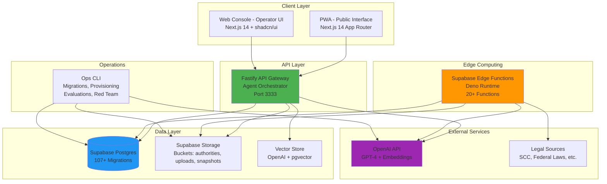
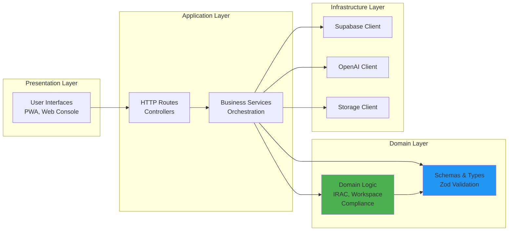
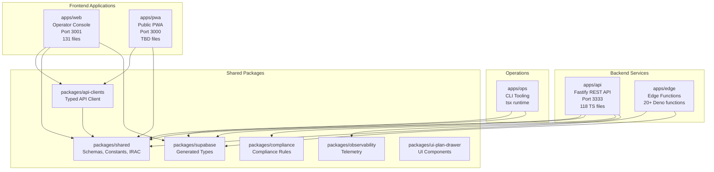
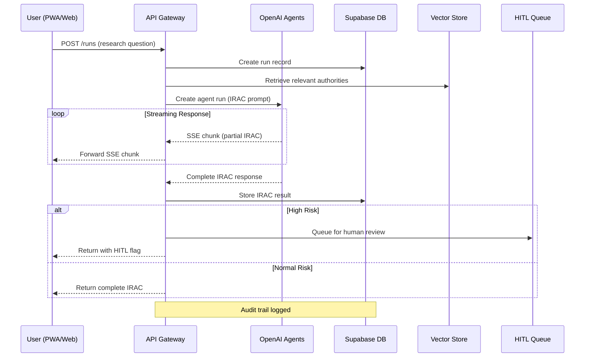
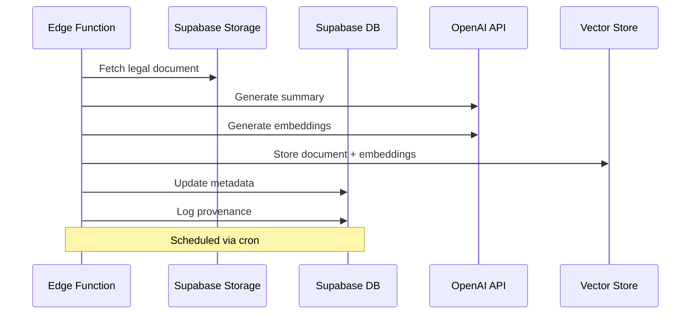
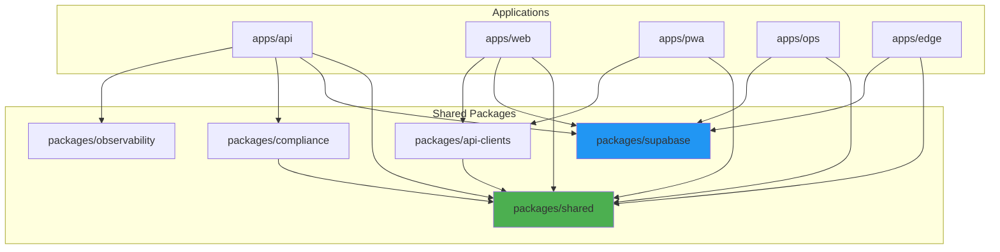
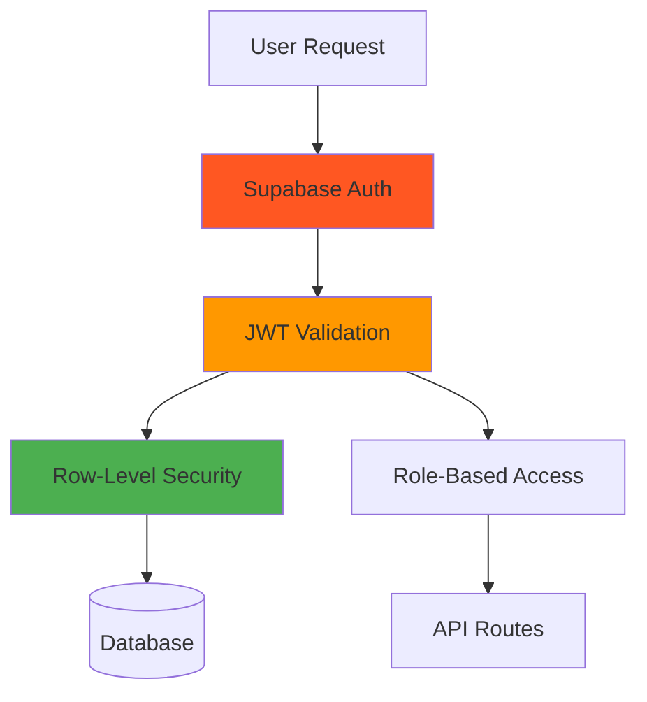
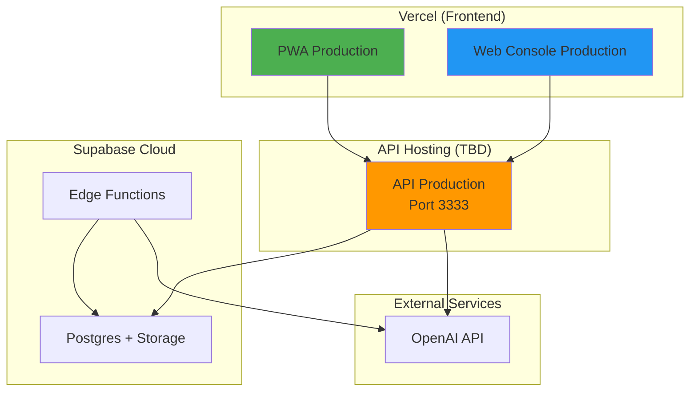

# Avocat-AI Architecture Documentation

_Last updated: 2025-10-29_

This document provides a comprehensive overview of the Avocat-AI Francophone legal AI system architecture, module boundaries, data flows, and operational patterns.

## Table of Contents

1. [System Overview](#system-overview)
2. [Architecture Layers](#architecture-layers)
3. [Module Map](#module-map)
4. [Data Flow](#data-flow)
5. [Dependency Graph](#dependency-graph)
6. [Technology Stack](#technology-stack)
7. [Security Architecture](#security-architecture)
8. [Deployment Architecture](#deployment-architecture)
9. [Integration Points](#integration-points)
10. [Observability](#observability)

---

## System Overview

Avocat-AI is a production-grade legal AI assistant designed for Francophone jurisdictions, built as a PNPM monorepo with multiple applications and shared packages.

### High-Level Architecture



### System Characteristics

- **Scale**: ~1,300 TypeScript/JavaScript files across 21 packages
- **Runtime**: Node.js 20 (API, Web, PWA, Ops) + Deno (Edge Functions)
- **Package Manager**: PNPM 8.15.4 with workspaces
- **Database**: Supabase Postgres with 107+ migrations
- **AI/ML**: OpenAI Agents SDK with GPT-4 and embeddings
- **Deployment**: Vercel (front-ends), Supabase (edge), containerized (API)

---

## Architecture Layers

The system follows a layered clean architecture pattern:



### Layer Responsibilities

| Layer | Purpose | Location | Rules |
|-------|---------|----------|-------|
| **Presentation** | User interfaces, API contracts | `apps/web/src`, `apps/pwa/src` | No direct DB/external service access |
| **Application** | HTTP handling, request orchestration | `apps/api/src/routes`, `apps/api/src/http` | Coordinates services, handles auth |
| **Domain** | Pure business logic, entities | `apps/api/src/domain`, `packages/shared/domain` | No I/O, framework-agnostic |
| **Infrastructure** | External integrations, persistence | `apps/api/src/infrastructure`, `packages/supabase` | Implements ports from domain |

---

## Module Map

### Applications



### Module Ownership

| Module | Owner | Description | Key Dependencies |
|--------|-------|-------------|------------------|
| `apps/api` | Platform Squad | Fastify REST API, agent orchestrator | Fastify, OpenAI SDK, Supabase |
| `apps/web` | Frontend Squad | Operator console for HITL review | Next.js 14, shadcn/ui, TanStack Query |
| `apps/pwa` | Frontend Squad | Public-facing PWA for litigants | Next.js 14, Radix UI, three.js |
| `apps/edge` | Platform Squad | Crawlers, schedulers, webhooks | Deno, Supabase Edge Runtime |
| `apps/ops` | Ops Team | Migration, provisioning, evaluation CLI | tsx, Zod, Supabase |
| `packages/shared` | Platform Squad | Domain schemas, IRAC definitions | Zod |
| `packages/supabase` | Platform Squad | Generated DB types, client helpers | Supabase JS |
| `packages/api-clients` | Platform Squad | Typed REST client | Fetch API, Zod |
| `packages/compliance` | Platform Squad | Compliance validation rules | Zod |
| `packages/observability` | Platform Squad | Telemetry, logging, metrics | OpenTelemetry |

---

## Data Flow

### Research Request Flow



### Document Ingestion Flow



---

## Dependency Graph

### Package Dependencies



### Dependency Rules

1. **No circular dependencies** between packages
2. **Domain layer** (`packages/shared/domain`) has zero external dependencies
3. **Infrastructure packages** (`packages/supabase`) may depend on domain
4. **Application layer** may depend on all packages
5. **Edge functions** use Deno-compatible packages only

---

## Technology Stack

### Core Technologies

| Layer | Technology | Version | Purpose |
|-------|-----------|---------|---------|
| Runtime | Node.js | 20.x | API, Web, PWA, Ops |
| Runtime | Deno | Latest | Edge Functions |
| Language | TypeScript | 5.4.5 | Type safety across all apps |
| Package Manager | PNPM | 8.15.4 | Monorepo workspace management |
| API Framework | Fastify | Latest | REST API server |
| Web Framework | Next.js | 14.x | PWA and Web console |
| UI Library (Web) | shadcn/ui | Latest | Operator console UI |
| UI Library (PWA) | Radix UI | Latest | Public interface UI |
| Database | Supabase (Postgres) | Latest | Primary data store |
| Vector DB | pgvector | Latest | Embedding storage |
| AI/ML | OpenAI API | Latest | GPT-4, embeddings, agents |
| Testing | Vitest | Latest | Unit and integration tests |
| E2E Testing | Playwright | Latest | End-to-end tests (Web) |
| Validation | Zod | 3.25.x | Runtime schema validation |

### Build & Development Tools

- **TypeScript Compiler**: tsc 5.4.5
- **Linter**: ESLint 8.57.0 (known to be deprecated)
- **SQL Formatter**: sql-formatter 15.6.10
- **Git Hooks**: Lefthook
- **CI/CD**: GitHub Actions

---

## Security Architecture

### Authentication & Authorization



### Security Layers

1. **Transport Security**: TLS 1.3 for all connections
2. **Authentication**: Supabase Auth with JWT tokens
3. **Authorization**: 
   - Row-Level Security (RLS) in Postgres
   - API-level RBAC checks
   - Resource ownership validation
4. **Data Protection**:
   - Secrets via environment variables (never committed)
   - Production rejects placeholder secrets
   - Encrypted storage buckets (private)
5. **Compliance**:
   - GDPR-compliant data handling
   - French judge analytics ban enforcement
   - FRIA/CEPEJ obligations validation
   - Audit trail for all operations

### Security Guardrails

- **Confidential Mode**: Suppresses web search when enabled
- **HITL Escalation**: High-risk queries queue for human review
- **Rate Limiting**: Applied per feature bucket
- **Input Validation**: Zod schemas at API boundaries
- **SQL Injection Prevention**: Parameterized queries via Supabase client

---

## Deployment Architecture

### Production Deployment



### Environment Matrix

| Environment | Purpose | Frontend Host | API Host | Database |
|-------------|---------|---------------|----------|----------|
| **Development** | Local dev | localhost:3000/3001 | localhost:3333 | Local Supabase |
| **Preview** | PR previews | Vercel preview | Staging API | Staging Supabase |
| **Staging** | Pre-production | staging.domain | staging.api.domain | Staging Supabase |
| **Production** | Live system | domain | api.domain | Production Supabase |

### Deployment Checklist

See [docs/release-runbook.md](./release-runbook.md) for complete deployment procedures.

---

## Integration Points

### External Services

| Service | Purpose | Authentication | Rate Limits |
|---------|---------|----------------|-------------|
| **OpenAI API** | GPT-4 completions, embeddings, agents | API Key | Per-tier limits |
| **Supabase** | Database, storage, auth, edge runtime | Service Role Key | Enterprise tier |
| **Legal Sources** | SCC, Federal Laws, Fedlex, etc. | Public/API keys | Varies by source |

### Internal APIs

| Endpoint | Method | Purpose | Auth Required |
|----------|--------|---------|---------------|
| `/runs` | POST | Create research run | Yes |
| `/corpus` | GET | Query document corpus | Yes |
| `/matters` | GET/POST | Manage legal matters | Yes |
| `/agents` | GET | List available agents | Yes |
| `/hitl` | GET/POST | Human-in-the-loop queue | Yes (operator) |
| `/admin/*` | Various | Admin operations | Yes (admin only) |
| `/realtime` | WebSocket | Real-time updates | Yes |
| `/voice` | WebSocket | Voice interface | Yes |
| `/healthz` | GET | Health check | No |

---

## Observability

### Logging

- **Format**: Structured JSON via Pino (API) and custom loggers (Edge)
- **Correlation IDs**: `x-trace-id` propagated across services
- **Log Levels**: error, warn, info, debug
- **Sensitive Data**: Scrubbed before logging (no PII/secrets)

### Metrics

- **System Metrics**: Request count, latency, error rate
- **Business Metrics**: IRAC generation count, HITL queue depth, citation accuracy
- **AI Metrics**: Token usage, model latency, embedding generation time

### Tracing

- **Implementation**: OpenTelemetry hooks (apps/api)
- **Trace Propagation**: Via `x-trace-id` header
- **Span Types**: HTTP requests, database queries, OpenAI calls

### Health Checks

```typescript
// Health check endpoints
GET /healthz - Basic health
GET /ready - Readiness probe (DB connectivity)
```

### Monitoring Dashboards

1. **Web Vitals**: LCP, INP, CLS (target: ≤2.5s, ≤200ms, ≤0.1)
2. **Accuracy Metrics**: Citation accuracy, temporal validity, retrieval recall
3. **Voice Latency**: Real-time voice interface performance
4. **Ops Alerts**: Nightly link health, regulator digests

---

## Known Issues & Technical Debt

### Current Known Issues

1. **Observability Package**: Type errors due to OpenTelemetry version conflict (non-blocking)
2. **Compliance Package**: Missing ESLint config (workspace-specific lint works)
3. **Lockfile Sync**: `apps/edge/package.json` out of sync (use `--no-frozen-lockfile` locally)
4. **API Observability Types**: MetricReader version mismatch (expected, ignore typecheck failures)

### Technical Debt

1. **API Monolith**: `apps/api/src/server.ts` exceeds 5,000 LOC - needs domain extraction
2. **Edge Function Duplication**: Repeated Supabase/OpenAI wiring - needs shared Deno libs
3. **Missing Tests**: Some modules lack comprehensive test coverage
4. **Migration Rollback**: Manual scripts exist but no automated rollback
5. **API Deployment**: Deployment strategy for API service not finalized

### Planned Improvements

See [docs/refactor/architecture.md](./refactor/architecture.md) for staged refactoring plan:

- **Stage 1**: DX foundations (linting, testing, documentation) ✓ In Progress
- **Stage 2**: Backend domain decomposition (extract API modules)
- **Stage 3**: Frontend feature modules (PWA modularization)
- **Stage 4**: Data hardening (migration automation, observability)
- **Stage 5**: Production readiness (performance, monitoring, runbooks)

---

## References

- [Internal Packages Overview](./architecture/internal-packages.md)
- [API Module Map](./architecture/module-map.md)
- [Environment Variables Matrix](./env-matrix.md)
- [Deployment Guide](./deployment/vercel.md)
- [Operations Runbooks](./operations/)
- [Launch Runbook](./operations/avocat-ai-launch-runbook.md)
- [Contributing Guidelines](../CONTRIBUTING.md)
- [Copilot Instructions](../.github/copilot-instructions.md)

---

## Maintenance

This document should be updated:

- When adding/removing applications or packages
- When changing deployment architecture
- When modifying security patterns
- When external integrations change
- After each major refactoring milestone

**Document Owner**: Platform Squad  
**Review Cadence**: Monthly or after major changes  
**Last Reviewed**: 2025-10-29
